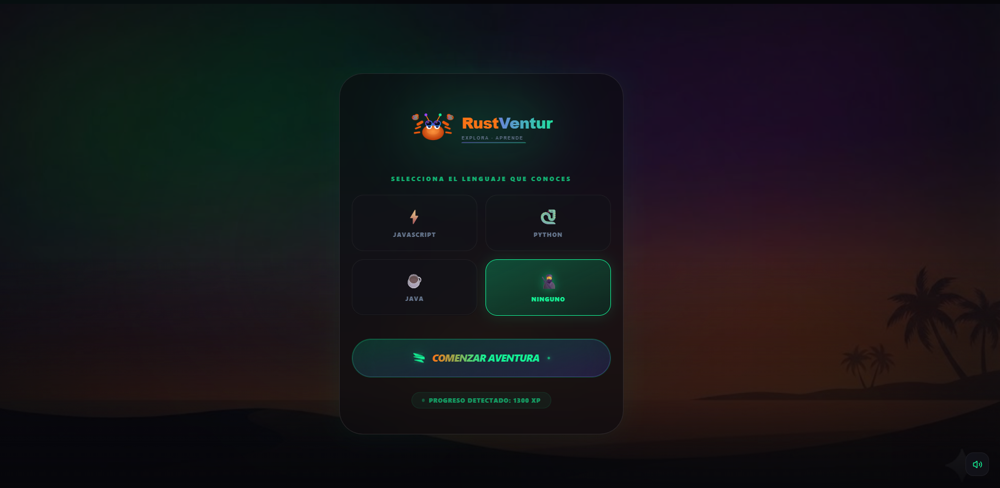
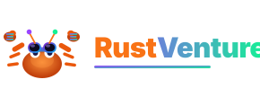

# 🦀 RustVenture: Explora · Aprende





**RustVenture** es una plataforma educativa gamificada diseñada para transformar la empinada curva de aprendizaje de **Rust** y **Solana** en una aventura épica. Olvida la documentación densa; aquí aprendes conquistando desafíos, ganando XP y desbloqueando insignias de explorador.

---

## 🚀 ¿Por qué RustVenture?

Aprender Rust y desarrollo en Solana puede ser intimidante. RustVenture nace de la necesidad de:
- **Gamificar el aprendizaje:** Convertir conceptos complejos de *ownership*, *borrowing* y *smart contracts* en hitos visuales.
- **Contextualizar:** Adaptar la enseñanza según el lenguaje que ya conoces (JS, Python, Java).
- **Incentivar la constancia:** Sistema de rachas y medallas para mantener la motivación al máximo.

---

## 🎮 Cómo Jugar

1.  **Elige tu Origen:** Al comenzar, selecciona el lenguaje de programación que ya dominas. RustVenture adaptará las comparaciones para que el aprendizaje sea más fluido.
2.  **Mapa de Aventuras:** Navega por un mapa interactivo con diferentes niveles, desde los fundamentos de Rust hasta la creación de Programas en Solana.
3.  **Supera Desafíos:** Cada nivel contiene retos de código y lógica. Responde correctamente para avanzar.
4.  **Gana XP e Insignias:** Acumula puntos de experiencia (XP) y colecciona insignias exclusivas como "RustVenture Hero" o "Explorer Goggles".
5.  **Domina el Ecosistema:** ¡Finaliza los niveles para convertirte en un desarrollador listo para el ecosistema Solana!

---

## ✨ Características Principales

- **Branding Moderno:** Inspirado en Rust (naranja/minimalista) y Solana (tecnológico/vibrante).
- **Audio Inmersivo:** Música Lo-Fi (cuando estás online) y efectos de sonido tipo "chime" para una experiencia concentrada y relajante.
- **Diseño Premium:** Interfaz construida con React, Tailwind CSS y Framer Motion para animaciones suaves y fluidas.
- **Persistencia:** Tu progreso se guarda localmente para que puedas retomar la aventura en cualquier momento.

---

## 🛠️ Stack Tecnológico

RustVenture utiliza un conjunto de herramientas modernas y eficientes para garantizar una experiencia de usuario rápida y fluida:

### **Frontend & Core**
- **[React 18](https://reactjs.org/):** Biblioteca principal para la construcción de la interfaz.
- **[Vite](https://vitejs.dev/):** Herramienta de construcción (build tool) ultra rápida para el desarrollo.
- **[Tailwind CSS](https://tailwindcss.com/):** Framework de utilidades CSS para un diseño moderno y responsive.
- **[Framer Motion](https://www.framer.com/motion/):** Motor de animaciones para transiciones suaves y micro-interacciones premium.

### **Efectos y Utilidades**
- **[Lucide React](https://lucide.dev/):** Set de iconos vectoriales consistentes y elegantes.
- **[Canvas Confetti](https://www.npmjs.com/package/canvas-confetti):** Efectos visuales de celebración al completar niveles.
- **[Clsx](https://www.npmjs.com/package/clsx) & [Tailwind Merge](https://www.npmjs.com/package/tailwind-merge):** Gestión avanzada y dinámica de clases de Tailwind.

### **Sistemas Internos**
- **Context API & Hooks:** Gestión de estado global y lógica de juego nativa (sin Redux).
- **Web Audio API:** Sistema de gestión de audio para música ambiental y efectos de sonido.
- **LocalStorage API:** Persistencia de progreso y sesión del usuario entre recargas.
- **SVG Vector Graphics:** Logos e iconos optimizados para resoluciones de alta densidad.

---

## 📦 Instalación y Desarrollo

Si quieres correr RustVenture localmente o contribuir al proyecto:

1.  **Clona el repositorio:**
    ```bash
    git clone https://github.com/tu-usuario/rust-game.git
    cd rust-game
    ```

2.  **Instala las dependencias:**
    ```bash
    npm install
    ```

3.  **Inicia el servidor de desarrollo:**
    ```bash
    npm run dev
    ```

4.  **Abre tu navegador:**
    Visita `http://localhost:5173` para empezar la aventura.

---

## 🦀 "Explora · Aprende"

Desarrollado con ❤️ para la comunidad de Rust y Solana.
